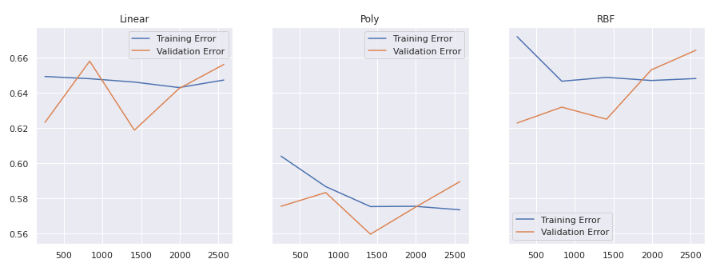
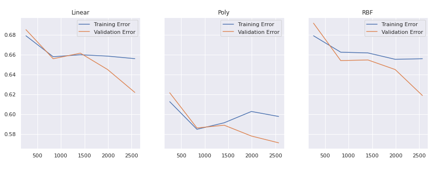
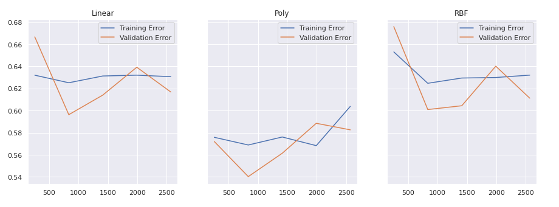

# CSC_4850-MachineLearning-AssignmentThree

This Colab notebook compares three different kernels for support vector machines on three different folds of a training set.

<h3> Fold 1:

</h3>

<h3> Fold 2:

</h3>

<h3> Fold 3:

</h3>
